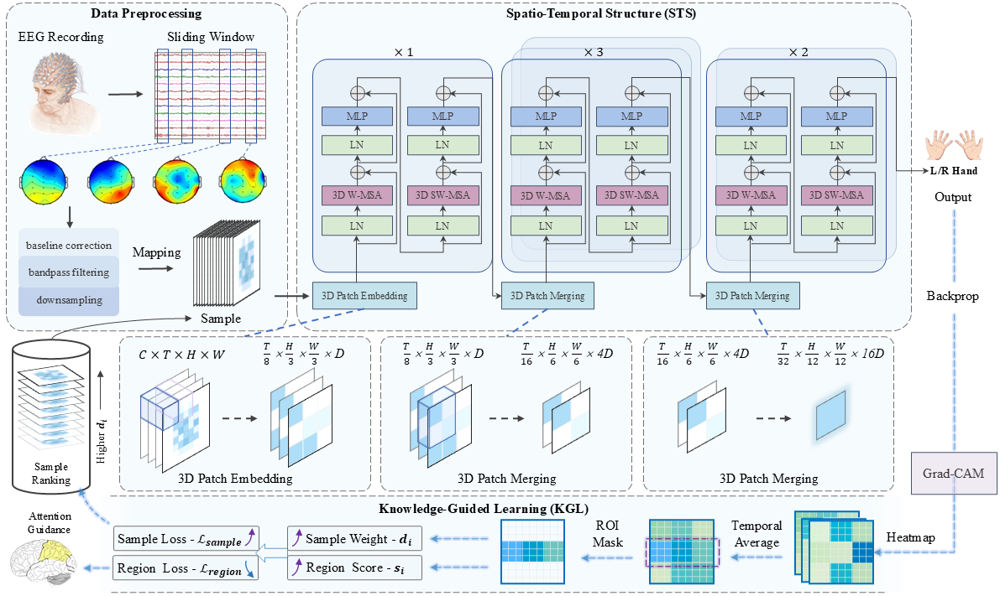

# SwinMI
## An Explainable Swin Transformer for EEG-based  Motor Imagery Classification in Stroke Patients

Stroke is a leading cause of long-term disability, with motor impairment severely affecting patients’ independence and quality of life. Conventional rehabilitation approaches are often limited, highlighting the need for innovative strategies. Motor Imagery (MI)-based Brain–Computer Interface (BCI) offers a promising rehabilitation paradigm for motor recovery. However, the complexity of stroke-related electroencephalography (EEG) signals pose challenges for accurate and interpretable MI classification. In this study, we propose an explainable Swin Transformer-based framework for MI classification in stroke patients. The model employs a Spatio-Temporal Structure (STS) to capture dynamic brain activity and a KnowledgeGuided Learning (KGL) strategy that incorporates neurophysiological knowledge to enhance interpretability. Experimental results demonstrate that our model outperforms existing methods under various evaluation protocols.

# SwinMI: Architecture



## Folder Structure

```
swinmi/
├── datasets/               # Contains dataset definitions and channel info
├── HSS_MI_Scripts/         # Scripts for training/testing on HSS MI dataset
├── models/                 # Model definitions
├── trainers/               # Training scripts with specific trainer classes
├── utils/                  # Utility functions
└── XW_MI_Scripts/          # Scripts for training/testing on Stroke MI 50 dataset
```